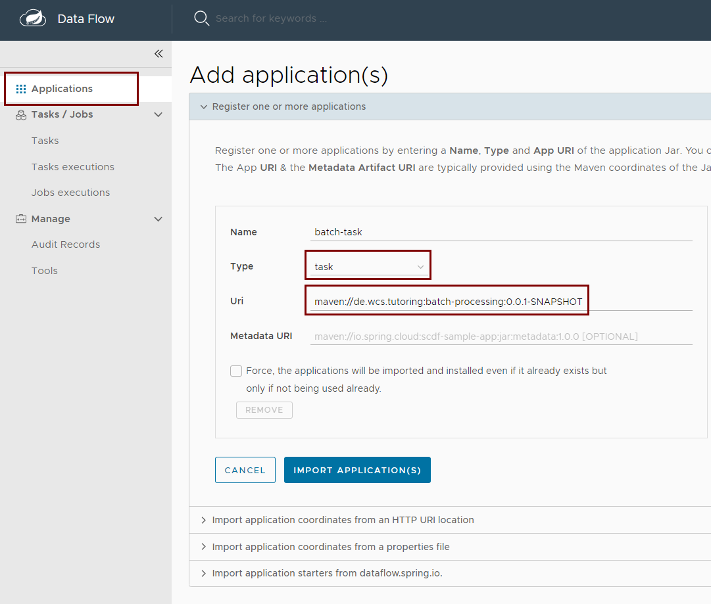
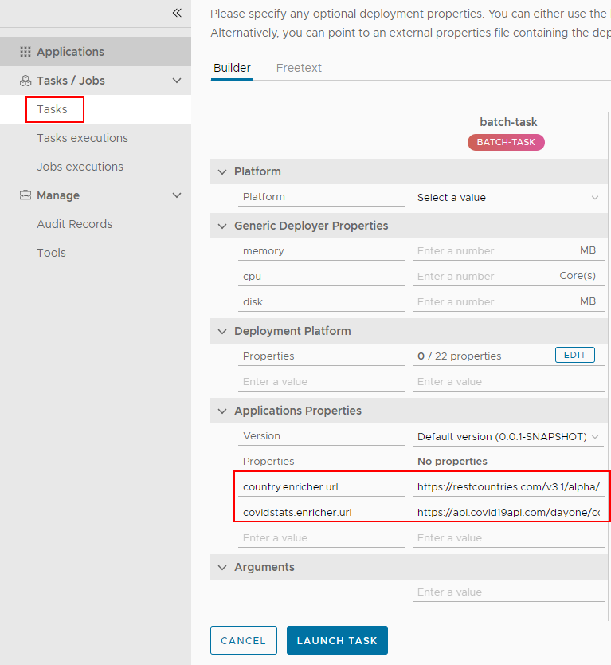

## Install Spring Cloud Dataflow

`wget https://repo.spring.io/release/org/springframework/cloud/spring-cloud-dataflow-server/2.9.1/spring-cloud-dataflow-server-2.9.1.jar`

## Env

```
export SPRING_CLOUD_DATAFLOW_FEATURES_STREAMS_ENABLED=false
export SPRING_CLOUD_DATAFLOW_FEATURES_SCHEDULES_ENABLED=false
export SPRING_CLOUD_DATAFLOW_FEATURES_TASKS_ENABLED=true
```

* For Windows:   `start_cloud_data.bat`
* For Mac/Linux: `start_cloud_data.sh`

## Deploy Batch Task

* Go to http://localhost:9393/dashboard
* After building the project with `mvn clean install` you can deploy the application with MVN coordinates: `maven://de.wcs.tutoring:batch-processing:0.0.1-SNAPSHOT`



* Create a Task and a Job for Starting the Spring Batch Job as a Cloud Data Flow Task 

## Start Task

* Note: You have to have a "task" deployed with Maven artifact: `maven://de.wcs.tutoring:batch-processing:0.0.1-SNAPSHOT`
* Add the configuration properties below for a success Batch run.

``` 
country.enricher.url=https://restcountries.com/v3.1/alpha/
covidstats.enricher.url=https://api.covid19api.com/dayone/country/
```

